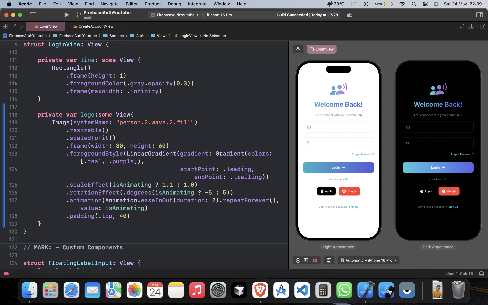
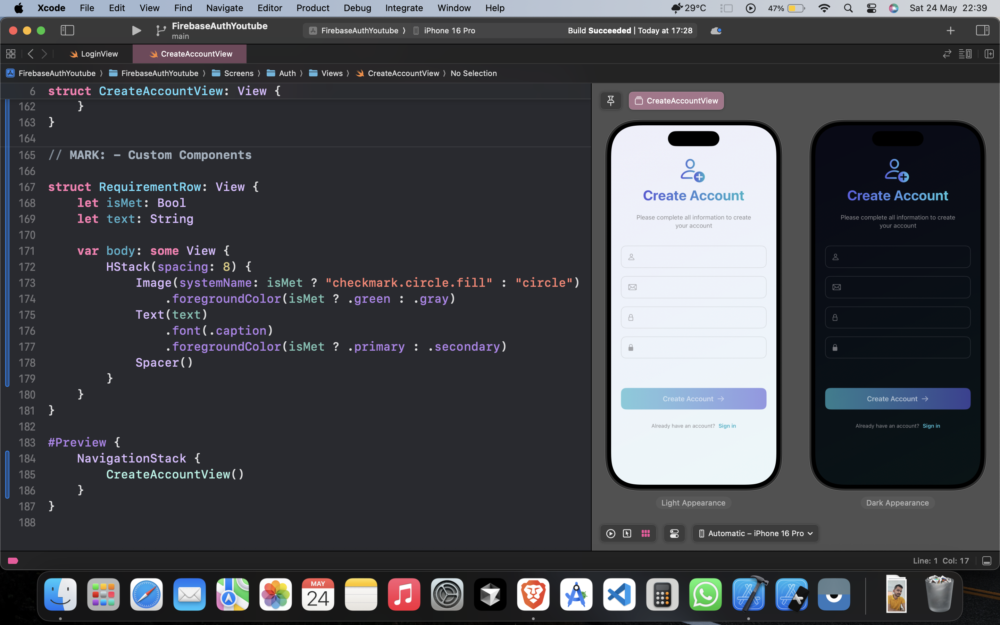

# Firebase Authentication App

A beautiful, modern SwiftUI authentication flow with email/password sign-up and login.

<!---->
<!---->
<!--
-->
<!--  -->
<!--  -->
<!--
-->

## ✨ Features

- **Beautiful Animations**: Smooth, purposeful animations throughout the UI
- **Secure Authentication**: Password handling with strength validation
- **Real-time Validation**: Instant feedback on form inputs
- **Modern Design**: Gradient backgrounds and custom UI components
- **Responsive Layout**: Adapts perfectly to all iOS device sizes
- **Social Login**: Options for Apple and Google authentication

## 📱 Screens

### Login Screen

- Email/password authentication
- Social login providers
- Forgot password option
- Animated welcome elements
- Form validation

### Registration Screen

- Complete sign-up form
- Password strength meter
- Real-time input validation
- Visual feedback indicators
- Secure password confirmation

## ⚙️ Requirements

- **Platform**: iOS 16.0+
- **Development**: Xcode 14+
- **Language**: Swift 5.7+
- **Dependencies**: Firebase Authentication

